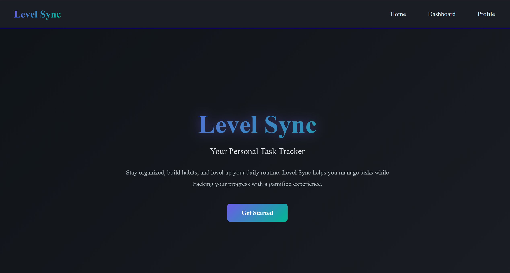
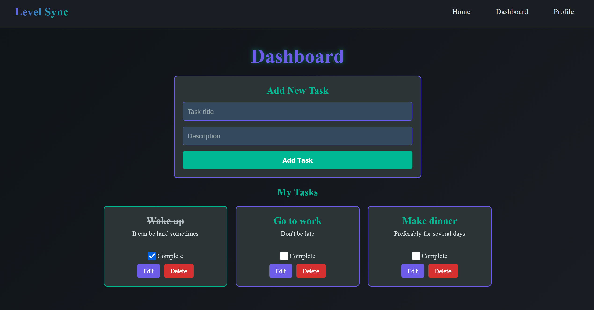
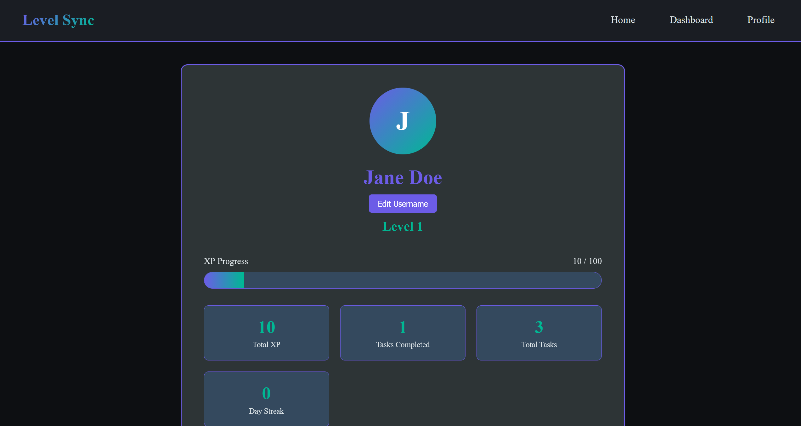

# Level Sync

🚀 **[Live Demo](https://levelsync-frontend.onrender.com)**

Your Personal Task & Progress Companion

---

# Project Overview
**Purpose:** Setting reminders and completing daily tasks to help keep track routines and chores

**Key Goals:** Improving life quality in a fun and motivational way

---

# Target Users
**Primary Users:** Teens and young adults, particularly those who struggle with structuring their daily routines

**User Needs:** Being able to keep track of daily tasks, such as eating, sleeping, cleaning, and working out. 

**Accessibility Considerations:** Readable fonts, different colour options, screen reader compatibility

---

# Core Features (MVP)
- [X] Feature 1: Create/edit/delete tasks
- [X] Feature 2: Task list view
- [X] Feature 3: Task completion tracking
- [ ] Feature 4: Simple XP/level system

---

## Future Features (Post-MVP)
- [ ] Customizable reminders
- [ ] Streak tracking
- [ ] User authentication
- [ ] Theme customization

---

## Technical Architecture
**Frontend:**
- Framework: React.js
- State Management: React Hooks
- Routing: React Router
- Styling: CSS styled-components

**Backend:**
- Server: Kotlin + Spring boot
- Database: PostgreSQL
- API: RESTful

**Deployment:**
- Frontend/Backend: Render

---

## User Interface
**Pages:**
- Home
- Dashboard (main task view)
- Profile

---

## Gamification Elements (Planned)
- Personal XP gain
- Level progression  
- Visual progress tracking

--- 

## Getting Started

### Prerequisites
- Node.js 17+
- Java 17+
- PostgreSQL

### Installation
1. Clone the repository
2. Install frontend dependencies: `cd client && npm install`
3. Set up database connection in `server/src/main/resources/application.properties`
4. Run backend: `cd server && ./gradlew bootRun`
5. Run frontend: `cd client && npm run dev`

## 🌐 Live Application

- **Frontend:** [https://levelsync-frontend.onrender.com](https://levelsync-frontend.onrender.com)
- **Backend API:** [https://levelsync-backend.onrender.com](https://levelsync-backend.onrender.com)

Note: The backend may take 30 seconds to wake up on first request (free tier limitation).